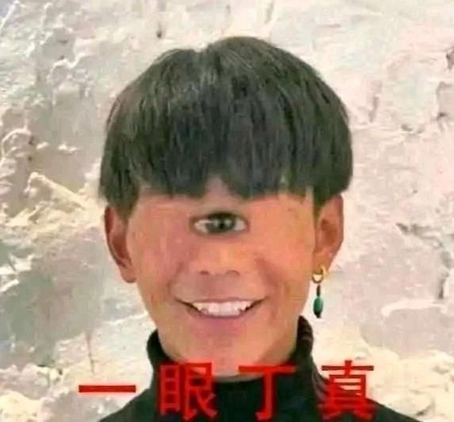
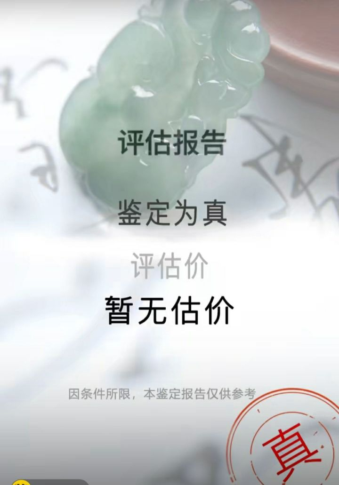
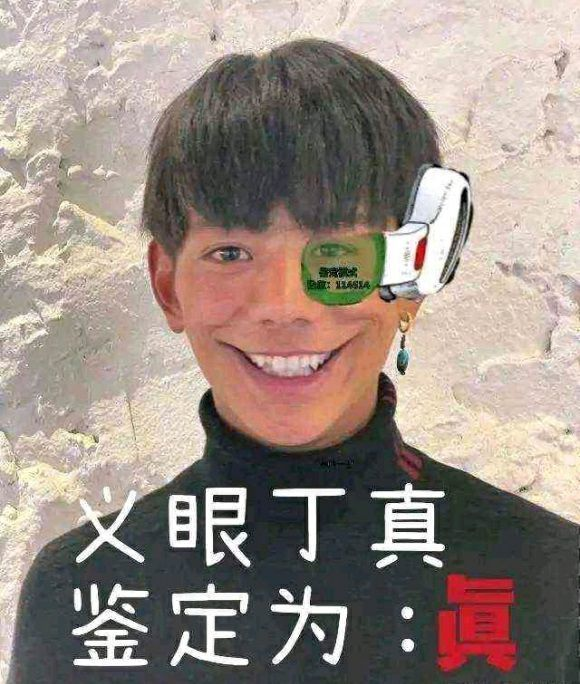
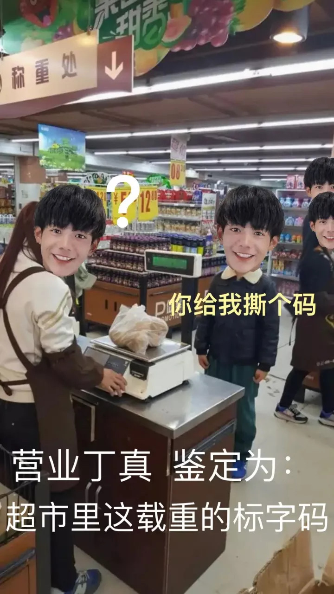
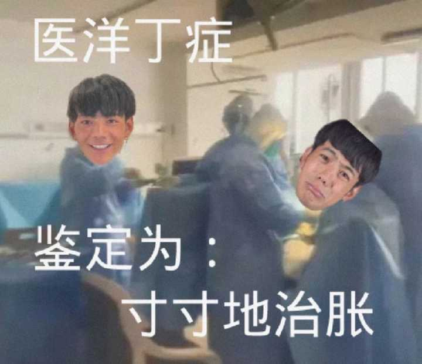
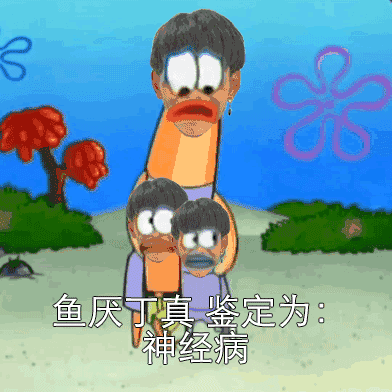
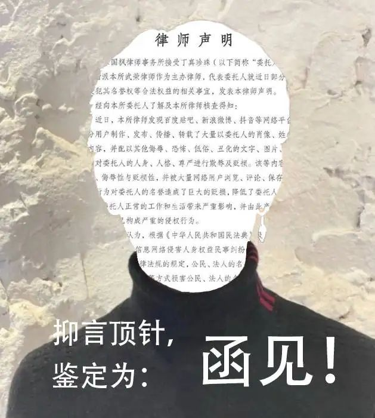

# README

## 这个仓库是干什么的？

本仓库收录来自互联网的丁真表情包，内容格式为：`YY`丁真，鉴定为：……   
其中 `Y` 指以汉语拼音声母 `Y` 开头的汉字。

## 丁真是谁？

丁真是一个来自四川省甘孜藏族自治州理塘县一个小山村的藏族小伙。

在2020年11月，丁真被摄影师胡波拍下一段短视频，其短视频被发送到网络平台后因纯真的笑容和清澈的双眼而迅速走红。

## 他的表情包又是怎么回事？

中文互联网上，低劣的营销号经常发布一些挑拨对立，煽动群众，骗点击的内容。这些内容有的是东拼西凑来的，有的则是直接凭空臆想出来的。热心的网友发现之后，为防止其他人上当受骗或浪费时间，会在评论区中评论：一眼假，xxxxxxxx（假的原因）

后来评论转变为：一眼真（反讽，意思为你编的跟真的一样，我都快信了）

丁真的视频迅速走红之后，该团队两周之内疯狂营销50多次热搜，丁真本人空降某国企并号称一己之力带动了当地旅游业的发展。丁真本人及其团队的行为引起了网友的不满：网友认为他在没有文化学历，小学仅读到三年级的情况下，只因为长相走红而进入国企，对寒窗苦读的人不公平；亦有网民认为，推崇像丁真这样靠长相出名并取得成功的人，是一种畸形的价值观。

之后官媒为其站台，并大力宣传。2020年12月20日，中国青年报客户端发表署名杨鑫宇的评论文章《“做题家”们的怨气，为何要往丁真身上撒？ 》，用网友用于自嘲的称呼「小镇做题家」形容批评该现象的网民。这种行为更加引起了网友的反感，之后便出现了该表情包：一眼丁真

当年，一档线上鉴宝节目也火了，每次鉴宝的末尾都会出现鉴定结果，如图：

于是，才艺出众的网友们纷纷当起了鉴定专家，亦不忘有事没事地嘲讽丁真，及表达对官媒的不满。

大家的创作开始了：

该图的出处已不可考。但无可置疑的是作为一切的开始，他开启了丁真宇宙，并对之后的创作有着巨大的影响：之后的网友也纷纷按照 `YY丁真，鉴定为：……` 的形式进行创作，其中以[孙笑川吧](https://tieba.baidu.com/f?ie=utf-8&kw=%E5%AD%99%E7%AC%91%E5%B7%9D&fr=search)（简称：孙吧）的吧友最为有才。本仓库最初的表情包大多来自孙吧。

随着网友们的才华被不断地发掘出来，即便模板存在限制，网友们依然能够创作出可以表达自己内心的作品。如

> 长难句

> 2022年3月31日，上海市第六人民医院微信公众号发布一则消息：“新冠疫情笼罩下的‘丁丁保卫战’”
> 
> 内容是在值此封城和疫情高发期间，他们医院倾尽全力拯救了一名外籍男子的阴茎
> 
> 于此形成鲜明对比的是那位得了哮喘病无法被救治，只能痛苦死去的国人。
> 
> 对此，网友鉴定为：

随着创作的进行，越来越多的作品透露出网友们其实并非对丁真本人有多大恨意，而是三观受到了巨大的冲击之后对现实的一种反击与调侃：我寒窗苦读多少年，独木桥人挤人终于进了国企，可有的人小学文化只凭一张脸和两颗小白牙直接就空降进去了。我们的一切努力，都显得荒唐，明明小时候告诉我们努力才有收获的也是你们。既然如此，何必这么拼呢？不如找些乐子乐呵乐呵。

现如今，「丁真」已然成为一种文化符号，象征着那些不（在大众赛道上）努力却依然获得了成功的人。丁真们的成功对平民百姓来说是那么触手可及（唱跳rap篮球谁不会？剪头被讹就一个吗？），却又那么遥不可及（平民百姓有条件一天睡十个小时然后练习滑雪吗？）

## 如何鉴定丁真系列表情包？

> 后现代解构主义思想与网络亚文化迷因结合的完美实践
> 
> ——知乎用户 [Bagor Lyter](https://www.zhihu.com/people/bagor-lyter)

## 里程碑

2022年4月12日，吧友[嘻嘻米德](https://tieba.baidu.com/home/main?id=tb.1.ff44178d.HauFJ0kBn6S6Z_Fxn1za5g&ie=utf-8&fr=pb)首次采用**GIF动图**的形式赋予丁真宇宙「时间」这一维度。

2022年5月8号，丁真的工作室突然在微博宣称将针对侮辱性 P 图的网友发放律师函维权，妄图打压网友们的创作热情。

该微博下的第一条评论如下图，可惜该评论现已被删除，未记录该大师的名称。

## 我如何参与进来？

欢迎提交 PR。

要求：

1. 无水印
2. 放置在 resource 目录下
3. 文件按内容命名
4. 不包含政治敏感等信息

## 参考

- [维基百科](https://zh.wikipedia.org/wiki/%E4%B8%81%E7%9C%9F)
- [百度百科](https://baike.baidu.com/item/%E4%B8%81%E7%9C%9F%E7%8F%8D%E7%8F%A0/55355315)
- [为何贴吧里的丁真越来越多？ - 烧经文的回答](https://www.zhihu.com/question/522114316/answer/2432243830)
- [如何评价孙笑川吧等贴吧吧友制作的“一眼丁真”系列表情包？- 重霄的回答](  https://www.zhihu.com/question/526181224/answer/2430576768)
